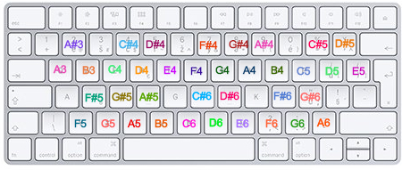

# #Cnthesizer #

#Cnthesizer is an application designed to simulate the most basic function of a synthesizer. Namely, the user can play different tones by pressing keyboard keys (not all keys correspond to a tone), they can automatically generate a beat, record what they have played, and modify the recording.

The app is written in C#, hence the name.

### Running the app
To run the app, run the file `Cnthesizer.exe`. It is essential that the file `NAudio.dll` be in the same location.

Alternatively, it is possible to download the code and build the project on your device.

## Features

### Playing tones

The main feature of the app (and in fact of everything that wants to pass as a musical instrument) is the ability to play different sounds. In this case, the different sounds are different tones. Playing them is done through the keyboard Each tone from A3 to A6 has a designated key. The precise layout is the following:

### Changing wave shape

If you are tired of the wave your music sounds, try changing the wave form! The app offers three different ones. Sine wave, which is the most basic and smoothest. Square wave, which is very harsh and rough. And finally, sawtooth wave, whose harshness is somewhere between sine and square. You can alter these shapes by clicking on the buttons under the `Select wave shape` text.

### Beat

Every good piece of music needs some percussions to complete the feeling. This app is able to do that for you! The only thing you have to do is to select a suitable value of bpm, or beats per minute. By clicking play, the beat plays on the background. Obviously, if you aren't satisfied with how fast or slow it is, you can always change the bpm by dragging the slider to the left or to the right.

### Recording

Once you are happy with the song you have composed you can save it. Unfortunately, the app doesn't have too good of a memory and doesn't remember anything unless you press the `Start recording` button. Everything since this moment is being recorded until you press the same button (which has by now changed to `Stop recording`). Don't worry about waiting until the right moment  so that the beat is there in the right moment; the beat resets after you click the button.

### Saving the recording

After the recording stops, the app will prompt you to enter a filename under which it will be saved. You can enter whatever you want or you can leave it blank, in which case the filename will be `recording.wav`. You can find the file in the same location as the `Cnthesizer.exe` file.

After confirming the filename, the app will prompt you to modify the recording. Obviously, you can leave it as it is and close the app or record a new song, or you can try some of the features the app offers.

### Shifting the pitch

Sometimes it happens that you realize that your melody would sound much better in a different scale. The app allows you to shift your recording by a given interval without changing any other temporal and spatial properties. You can select a shift by any interval up to an octave both higher and lower. To get the original recording back, simply select `Unison`.

### Adding a harmony - manually

No melody is complete without a harmony. If you haven't added it during recording, don't worry, it is still possible to do so. The app can pre-generate suitable chords for you and you can add them to your recording. First, you need to select what scale your recording is in. Without doing this, the app wouldn't be able to tell which chords are good for it. Then, click `Add harmony`. A new window will appear with eight different chords and your recording will start playing. As it plays, you can click the buttons to add the corresponding chords. The window won't close after the recording stops, so you can still play with the buttons, but beware that the app will cut off anything after that. Once you click the `Close` button, the harmony is added to the recording.

### Adding a harmony - automatically

Sometimes it is not easy to tell which chords you should choose. The app can suggest most popular chord progressions and add them to your recording for you. Beware that this feature only works if you had beat on during the recording - otherwise it is not possible to tell when a chord can play! You can modify it so that a new chord plays every first, second, third or fourth beat. Click `Generate` and the harmony will be there!

If you create a new harmony, in both cases - automatic and manual - the previously added harmony will be discarded.

## That's it!

Enjoy playing with the app!

